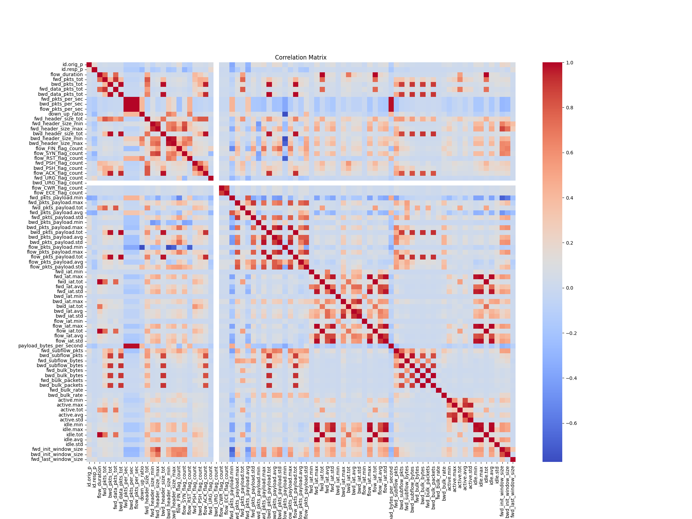
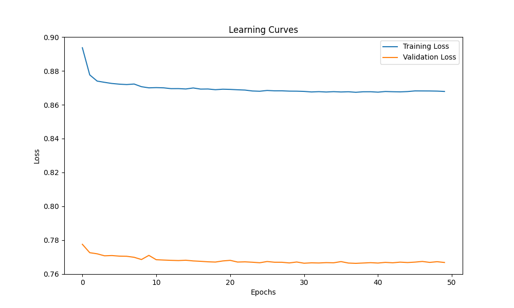
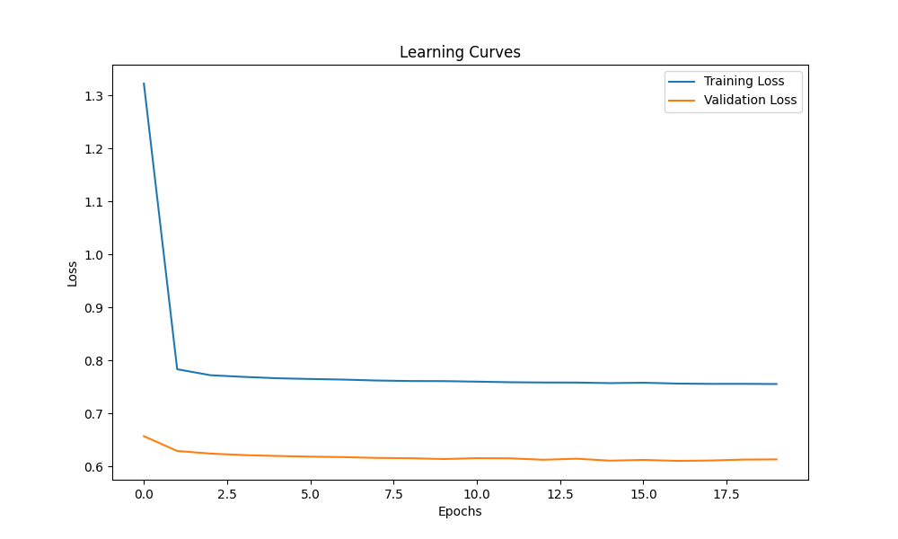
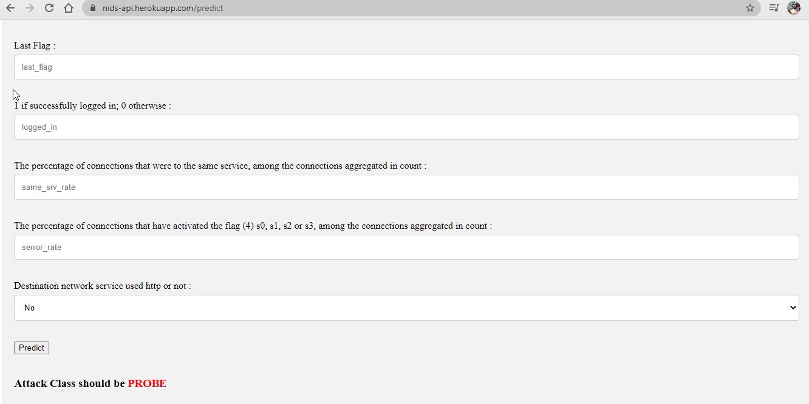

# 7ARTH - CyberSecurity Graduation Project


<p align="center">
  
</p>

> **7ARTH (أرض)** - Protecting Your Digital Battlefield | مشروع تخرج في الأمن السيبراني

---

## 📋 Overview

A comprehensive **Intrusion Detection System (IDS)** graduation project combining **Machine Learning**, **Deep Learning**, and **Real-time Network Analysis**. The project consists of **7 sub-systems** covering **4 security domains**:

| Domain | Sub-Systems |
|--------|-------------|
| 🛡️ **Network Intrusion Detection** | Real-time-IDS, Network-Intrusion-Detection, APT_Detect |
| 📡 **IoT Security** | 7ARTH/IOT (Quantized Autoencoder) |
| 🦠 **Malware / Ransomware** | 7ARTH/ransomware_detect |
| 🔗 **URL / Phishing** | 7ARTH/url |

---

## 🏗️ Project Structure

```
7ARTH-Graduation-Project/
│
├── images/                            # Banner + training visualizations
│
├── Real-time-IDS-master/              # MAIN: Real-time IDS
│   ├── application.py                 # Flask + SocketIO (429 lines)
│   ├── flow/                          # Flow engine
│   │   ├── Flow.py                    # Flow management + 39 features
│   │   ├── FlowFeature.py             # Feature data class
│   │   └── PacketInfo.py              # Packet extraction
│   ├── models/                        # RF classifier + Autoencoder
│   ├── templates/                     # Web UI
│   └── static/                        # CSS, JS, images
│
├── Network-Intrusion-Detection-       # Web IDS (NSL-KDD)
│   System-master/
│   ├── app.py                         # Flask web app
│   ├── model.pkl                      # Trained classifier
│   └── NSL_Dataset/                   # NSL-KDD train/test
│
├── APT_Detect/                        # PyTorch APT detection
│   ├── code/Untitled-2.ipynb         # PyTorch neural network
│   ├── data/flowFeatures.csv          # 1.67M flows (81 features)
│   └── model/                         # Trained model + encoder
│
└── 7ARTH/                             # Security suite
    ├── attack_detect/                 # 10 models on UNSW-NB15
    ├── IOT/                            # QAE for IoT + TFLite
    ├── ransomware_detect/             # Memory malware (kNN)
    └── url/                           # Phishing URL detection
```

---

## 📊 Results Summary

| # | Project | Best Model | Accuracy | Dataset |
|---|---------|------------|----------|---------|
| 1 | **Real-time-IDS** | Random Forest + Autoencoder | Real-time | CICIDS 2018 |
| 2 | **Network-Intrusion-Detection** | Decision Tree (CV) | **99.85%** CV | NSL-KDD |
| 3 | **APT_Detect** | PyTorch Neural Network | (in progress) | Flow Features |
| 4 | **attack_detect (UNSW-NB15)** | Random Forest | **97.68%** | UNSW-NB15 |
| 5 | **IOT (QAE)** | Quantized Autoencoder | TFLite edge | RT_IOT2022 |
| 6 | **ransomware_detect** | kNN / RF (Tie) | **99.98%** | MalMem2022 |
| 7 | **URL Detection** | Random Forest | **96.73%** | malicious_phish |

---

## 🔬 Detailed Results

### 1. UNSW-NB15 Attack Detection (7ARTH/attack_detect)

**Dataset:** UNSW-NB15 (training: ~175K, testing: ~82K records, 9 attack types + Normal)

| Model | Accuracy | Precision | Recall | F1-Score | Train Time |
|-------|----------|-----------|--------|----------|------------|
| **Random Forest** | **97.68%** | **97.69%** | **97.68%** | **97.68%** | 5.47s |
| Extra Trees | 97.53% | 97.55% | 97.53% | 97.53% | 3.67s |
| Decision Tree | 96.38% | 96.38% | 96.38% | 96.38% | 1.38s |
| MLP (Neural Network) | 96.25% | 96.26% | 96.25% | 96.26% | 18.21s |
| Gradient Boosting | 95.85% | 95.86% | 95.85% | 95.85% | 46.92s |
| kNN (k=3) | 95.04% | 95.09% | 95.04% | 95.05% | 0.01s |
| Logistic Regression | 92.80% | 92.83% | 92.80% | 92.80% | 1.68s |

**🏆 Winner: Random Forest** - Best balance of accuracy (97.68%) and speed (5.47s training).

---

### 2. Ransomware Memory Detection (7ARTH/ransomware_detect)

**Dataset:** Obfuscated-MalMem2022 (Memory dumps: ransomware, malware, benign)

| Model | Accuracy | Precision | Recall | F1-Score |
|-------|----------|-----------|--------|----------|
| **K-Nearest Neighbors (GridSearch)** | **99.982%** | **100.00%** | 99.965% | **99.982%** |
| **Random Forest (GridSearch)** | **99.977%** | **100.00%** | 99.953% | **99.976%** |
| Decision Tree (GridSearch) | 99.941% | 99.976% | 99.905% | 99.941% |
| Logistic Regression (GridSearch) | 99.900% | 99.941% | 99.858% | 99.899% |
| Stochastic Gradient Descent | 99.824% | 99.929% | 99.716% | 99.822% |
| Support Vector Machine | 99.056% | 98.559% | 99.550% | 99.052% |
| Naive Bayes | 98.195% | 97.681% | 98.698% | 98.187% |

**🏆 Tie: kNN (99.982%) & Random Forest (99.977%)** - Near-perfect detection with 0 false positives (FP=0).

---

### 3. Malicious URL Detection (7ARTH/url)

**Dataset:** malicious_phish (65,120 URLs, 4 classes: benign, phishing, malicious, defacement)

| Model | Accuracy | Macro F1 | Weighted F1 |
|-------|----------|----------|-------------|
| **Random Forest** | **96.73%** | **95.54%** | **96.70%** |
| XGBoost | 96.37% | 94.74% | 96.30% |

**Per-class Performance (Random Forest):**
| Class | Precision | Recall | F1-Score | Support |
|-------|-----------|--------|----------|---------|
| Benign (0) | 0.97 | 0.99 | 0.98 | 42,951 |
| Phishing (1) | 0.98 | 1.00 | 0.99 | 9,557 |
| Defacement (2) | 0.99 | 0.95 | 0.97 | 3,253 |
| Malicious (3) | 0.91 | 0.86 | 0.89 | 9,359 |

**🏆 Winner: Random Forest (96.73%)** - Slightly outperforms XGBoost on all metrics.

---

### 4. Network Intrusion Detection (NSL-KDD)

**Dataset:** NSL-KDD (125,973 training records, 41 features, 5 classes)

| Model | Best CV Accuracy |
|-------|-----------------|
| Decision Tree (GridSearch) | **99.85%** |
| Ridge Classifier | 96.00% |
| Logistic Regression | 83.80% |

**Test Set Classification Report (Decision Tree):**
| Class | Precision | Recall | F1-Score |
|-------|-----------|--------|----------|
| Normal | 1.00 | 1.00 | 1.00 |
| DOS | 0.87 | 0.92 | 0.89 |
| PROBE | 0.46 | 0.95 | 0.62 |
| R2L | 0.00 | 0.00 | 0.00 |
| U2R | 0.00 | 0.00 | 0.00 |

**Test Accuracy: 84%** - Note: R2L and U2R classes have very few samples (imbalanced dataset).

---

### 5. Real-time-IDS (Main System)

**Architecture:**
- **Supervised:** Random Forest (8 classes: Benign, Botnet, DDoS, DoS, FTP-Patator, Probe, SSH-Patator, Web Attack)
- **Unsupervised:** Autoencoder (39-feature reconstruction error for anomaly detection)
- **Explainability:** LIME (Local Interpretable Model-agnostic Explanations)
- **Risk Scoring:** Very High / High / Medium / Low / Minimal

**39 Features extracted per flow:**
- Duration & IAT statistics (FlowDuration, FlowIATMean/Std/Max/Min)
- Forward IAT (FwdIATTotal/Mean/Std/Max/Min)
- Backward IAT (BwdIATTotal/Mean/Std/Max/Min)
- Packet lengths (BwdPacketLen, MaxPacketLen, PacketLenMean/Std/Var)
- TCP Flags (FIN, SYN, PSH, ACK, URG counts)
- Window size (InitWinBytesFwd/Bwd)
- Throughput (FwdPackets/s)
- Activity (ActiveMin, IdleMean/Std/Max/Min)

---

### 6. IoT Intrusion Detection (7ARTH/IOT)

**Technique:** Quantized Autoencoder (QAE)

**Optimization Pipeline:**
| Step | Technique | Size Reduction | Description |
|------|-----------|---------------|-------------|
| 1 | Pruning | 90% sparsity | Remove near-zero weights |
| 2 | Clustering | 16 clusters | Group similar weights |
| 3 | Quantization | 32-bit → 8-bit | Integer quantization |

**Output Models:**
| File | Format | Optimized |
|------|--------|-----------|
| autoencoder_model.h5 | Keras H5 | Original |
| autoencoder_model.tflite | TFLite | Converted only |
| autoencoder_pruned_model.tflite | TFLite | Pruned 90% |
| autoencoder_int_quant_model.tflite | TFLite | Integer quantized |
| autoencoder_clustered_model.tflite | TFLite | Weight clustered |
| best_optuna_model.keras | Keras | Optuna-optimized |

---

## 📸 Visualizations

### Correlation Matrix (Feature Relationships)
<p align="center">
  
</p>

### Autoencoder Learning Curves
<p align="center">
  
</p>

### QAE Training Progress
<p align="center">
  
</p>

### NIDS Web Interface
<p align="center">
  
</p>

---

## 🛠️ Technologies

| Category | Technologies |
|----------|-------------|
| **Language** | Python 3.9 |
| **Web** | Flask 2.1, SocketIO, Bootstrap, Chart.js |
| **Packet Capture** | Scapy 2.4.5, Npcap 1.71 |
| **ML / DL** | scikit-learn, TensorFlow 2.11, Keras, PyTorch |
| **Boosting** | XGBoost, LightGBM, Gradient Boosting |
| **Optimization** | Optuna, GridSearchCV |
| **Edge AI** | TensorFlow Lite (pruning, clustering, quantization) |
| **Explainability** | LIME |
| **Visualization** | Plotly, Matplotlib |
| **Utilities** | pandas, numpy, psutil, joblib, dill |

---

## 🚀 How to Run

### Prerequisites
```bash
# Windows only! Requires Npcap 1.71
# Download: https://npcap.com/dist/npcap-1.71.exe
# Python 3.9: https://www.python.org/downloads/release/python-3913/
```

### Real-time-IDS (Main System)
```bash
cd Real-time-IDS-master
python -m venv venv
.\venv\Scripts\activate
pip install -r requirements.txt
python application.py
# Open http://localhost:5000
```

### Network-Intrusion-Detection-System
```bash
cd Network-Intrusion-Detection-System-master
pip install flask joblib scikit-learn numpy
python app.py
# Open http://localhost:5000
```

---

## 📄 License

MIT License - This project is for educational purposes.

---

## 📚 References

- [CICIDS 2018 Dataset](https://www.unb.ca/cic/datasets/)
- [NSL-KDD Dataset](https://www.unb.ca/cic/datasets/nsl.html)
- [UNSW-NB15 Dataset](https://research.unsw.edu.au/projects/unsw-nb15-dataset)
- [Obfuscated-MalMem2022](https://www.unb.ca/cic/datasets/malmem-2022.html)
- [CICFlowMeter](https://github.com/CanadianInstituteForCybersecurity/CICFlowMeter)
